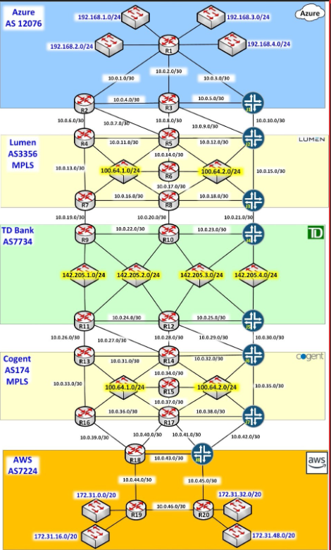

# MPLS-Core-Project

## Objective
To design and simulate an MPLS network for client TD Bank and its resources via ISP providers like Lumen and Cogent. Simulated on GNS3.

## Requirements
### Client
- TD Bank has on-premise datacentres with the subnets 142.205.1.0/24, 142.205.2.0/24, 142.205.3.0/24, and 142.205.4.0/24.  
- TD Bank has also resources in the cloud, both in Microsoft Azure and Amazon AWS. 
- TD Bank has direct connect style MPLS tunnels to Microsoft Azure and AWS.

### MPLS Service Provider
- Lumen provides the MPLS transport service to TD's Azure resources. 
- Cogent provides the MPLS transport service to TD's AWS resources. 
- Any computing resource connected to TD’s networks (142.205.1.0/24, 142.205.2.0/24, 142.205.3.0/24, and 142.205.4.0/24) must have connectivity with the compute resources in Azure and AWS.  
- The TD compute resources located in the two cloud providers must have mutual access for replication purposes.

### Marking
TD also marks its networks with BGP community values to alter routing paths take. The decisions taken are:
| Community | To Reach Network | Meaning
| --- | ----------- | ------------
| 7734:1 | 142.205.1.0/24 | R2 is the preferred via router from R1
| 7734:2 | 142.205.2.0/24 | R3 is the preferred via router from R1
| 7734:3 | 142.205.3.0/24 | J1 is the preferred via router from R1
| 7734:3 | 142.205.3.0/24 | J8 is the preferred via router from R19 and R20
| 7734:4 | 142.205.4.0/24 | R18 is the preferred via router from R19 and R20

For everything else the routing paths are left to their default values

## Topology
Here is the topology for the network design:

## Vendors
As seen in the topology, the routing vendors and used in the project are Cisco and Juniper, with operating systems IOS and Junos respectively.
